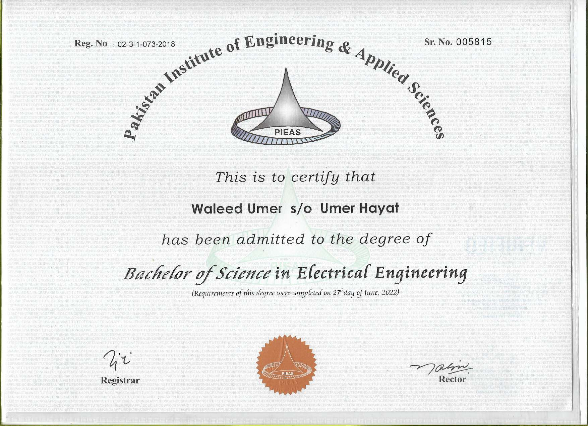
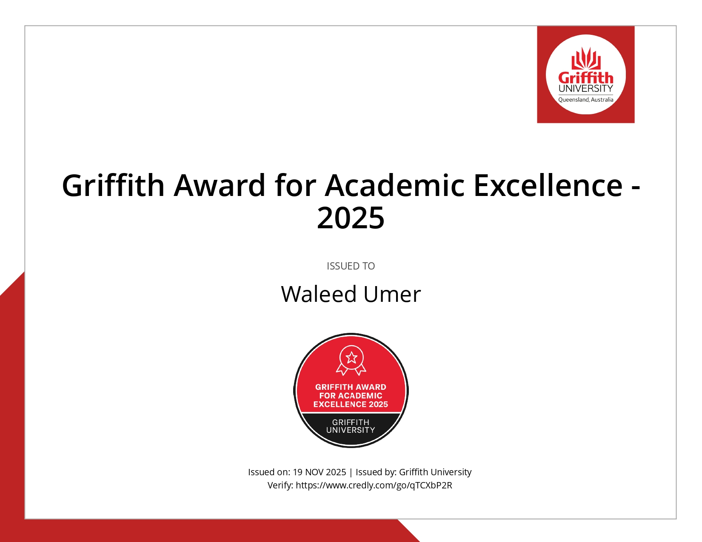
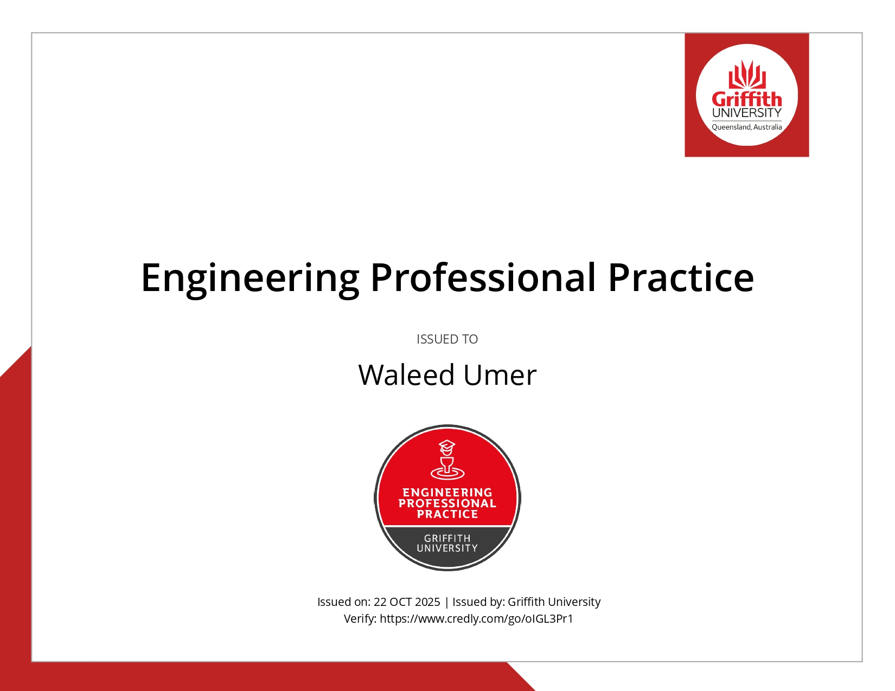
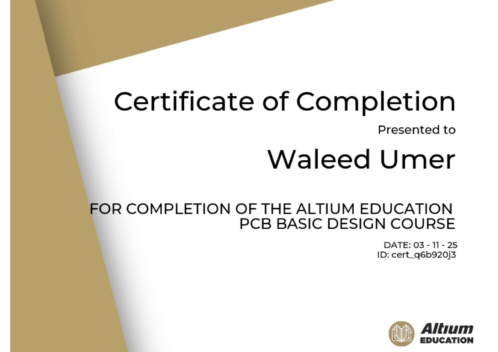
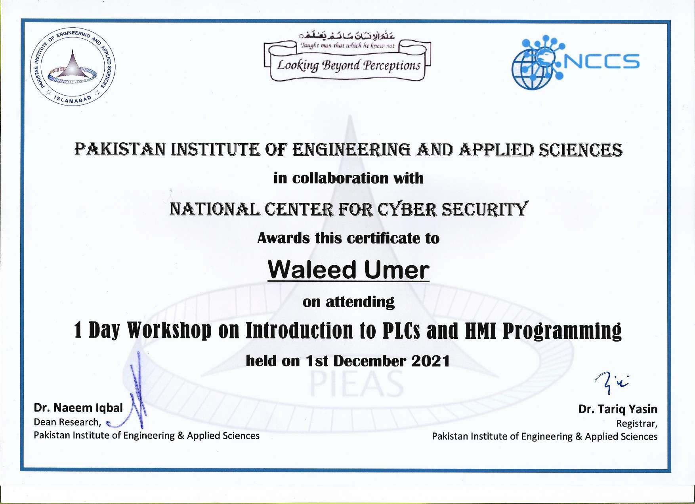
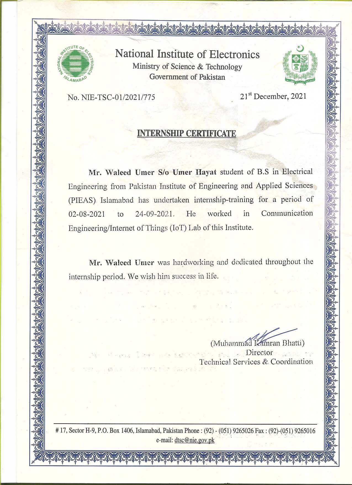
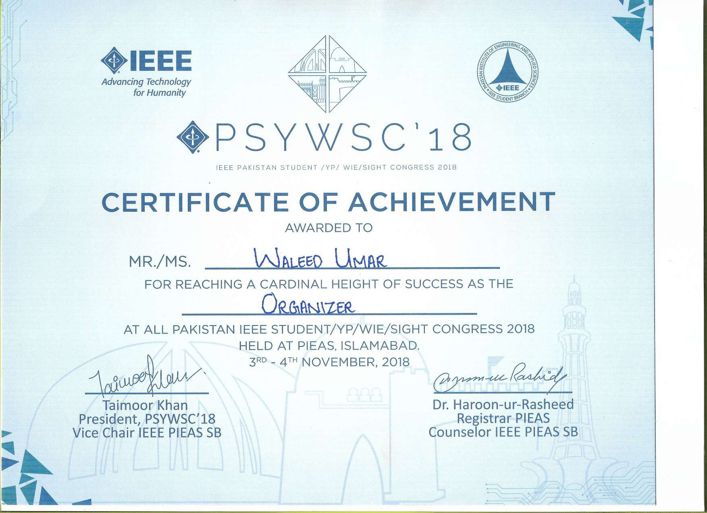
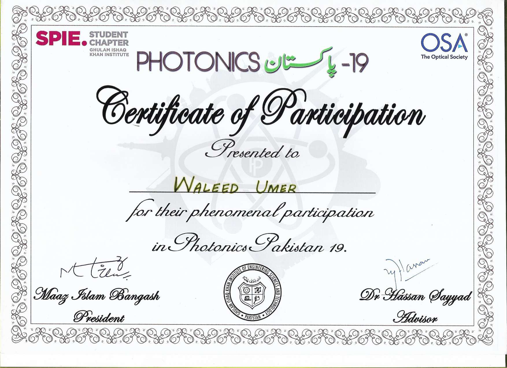
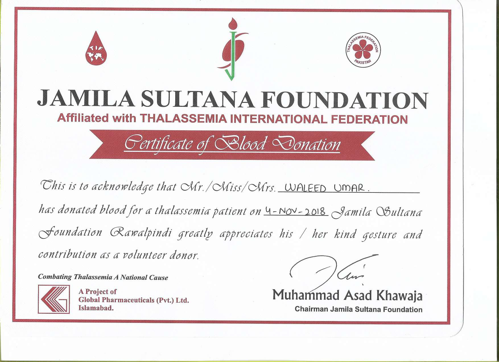

<h2>📜 Certifications & Achievements</h2>

  <i>A collection of academic achievements, professional certifications, and workshop participation certificates showcasing continuous learning and professional development in engineering and technology.</i>

---

<h3>🎓 Academic Credentials</h3>

📘 Click to view Academic Certificates

 

<h4>Bachelor of Science in Electrical Engineering</h4>

<b>Institution:</b> Pakistan Institute of Engineering and Applied Sciences (PIEAS)

<b>Graduation Date:</b> June 27, 2022

<b>Registration No:</b> 02-3-1-073-2018 | <b>Serial No:</b> 005815

<h3>🎓 Griffith University - Recent Achievements (2025)</h3>

<h4>Master of Professional Engineering</h4>

<b>Institution:</b> Griffith University, Queensland, Australia

<b>Degree:</b> Master of Professional Engineering

<b>Major:</b> Electronic Engineering

<b>Award Date:</b> December 11, 2025

<b>Program Completion:</b> November 4, 2025

<b>Recognition:</b> Australian Qualifications Framework certified

<b>Award Number:</b> 53J6317/325:400

<b>Signed by:</b> Professor Carolyn Evans (Vice Chancellor and President) and The Honourable Andrew Fraser (Chancellor)

<h4>Griffith Award for Academic Excellence 2025</h4>

<b>Institution:</b> Griffith University, Queensland, Australia

<b>Award:</b> Griffith Award for Academic Excellence

<b>Year:</b> 2025

<b>Issued Date:</b> November 19, 2025

<b>Recognition:</b> Outstanding academic performance and excellence in studies

<b>Verification:</b> <a href="https://www.credly.com/go/qTCXbP2R">https://www.credly.com/go/qTCXbP2R</a>

<h4>Engineering Professional Practice Certificate</h4>

<b>Institution:</b> Griffith University, Queensland, Australia

<b>Certificate:</b> Engineering Professional Practice

<b>Issued Date:</b> October 22, 2025

<b>Recognition:</b> Completion of professional engineering practice requirements

<b>Verification:</b> <a href="https://www.credly.com/go/oIGL3Pr1">https://www.credly.com/go/oIGL3Pr1</a>

---

<h3>🏆 Professional Certifications & Workshops</h3>

🔧 Click to view Technical Certifications

 
<h4>Altium Education - PCB Basic Design Course</h4>

<b>Course:</b> Altium Education PCB Basic Design Course

<b>Provider:</b> Altium Education

<b>Completion Date:</b> November 3, 2025

<b>Certificate ID:</b> cert_q6b920j3

<b>Skills Acquired:</b> PCB layout fundamentals, component placement, routing techniques, design rule checking, and Altium Designer software proficiency

<h4>Introduction to PLCs and HMI Programming</h4>

<b>Organized by:</b> Pakistan Institute of Engineering and Applied Sciences (PIEAS) in collaboration with National Center for Cyber Security (NCCS)

<b>Duration:</b> 1 Day Workshop

<b>Date:</b> December 1, 2021

<b>Skills Acquired:</b> PLC Programming, HMI Interface Design, Industrial Automation

<h4>National Institute of Electronics Internship</h4>

<b>Organization:</b> National Institute of Electronics, Ministry of Science & Technology, Government of Pakistan

<b>Duration:</b> August 2, 2021 - September 24, 2021

<b>Project:</b> Communication Engineering/Internet of Things (IoT) Lab

<b>Certificate No:</b> NIE-TSC-01/2021/775

<b>Performance:</b> Hardworking and dedicated throughout the internship period

---

<h3>🎖️ Conference Participation & Leadership</h3>

📊 Click to view Conference Certificates

 

<h4>IEEE Pakistan Student/YP/WIE/SIGHT Congress 2018 (PSYWSC'18)</h4>

<b>Role:</b> Organizer

<b>Event:</b> All Pakistan IEEE Student/YP/WIE/SIGHT Congress 2018

<b>Venue:</b> PIEAS, Islamabad

<b>Date:</b> November 3-4, 2018

<b>Achievement:</b> Reached a cardinal height of success as the Organizer

<b>Signed by:</b> Taimoor Khan (President, PSYWSC'18, Vice Chair IEEE PIEAS SB) and Dr. Haroon-ur-Rasheed (Registrar PIEAS, Counselor IEEE PIEAS SB)

<h4>Photonics Pakistan 2019</h4>

<b>Organized by:</b> SPIE Student Chapter Ghulam Ishaq Khan Institute in collaboration with OSA (The Optical Society)

<b>Recognition:</b> Certificate of Participation for phenomenal participation

<b>Event:</b> Photonics Pakistan 19

<b>Signed by:</b> Maaz Islam Bangash (President) and Dr. Hassan Sayyad (Advisor)

---

<h3>🩸 Community Service & Social Contributions</h3>

❤️ Click to view Social Contribution Certificates

 

<h4>Blood Donation Certificate</h4>

<b>Organization:</b> Jamila Sultana Foundation (Affiliated with Thalassemia International Federation)

<b>Date of Donation:</b> November 4, 2018

<b>Blood Group:</b> B Positive

<b>Purpose:</b> Blood donation for a thalassemia patient

<b>Location:</b> Rawalpindi

<b>Recognition:</b> Contribution as a volunteer donor greatly appreciated by the foundation

---

<h3>📊 Certification Summary</h3>

<table>
  <tr>
    <th>Category</th>
    <th>Number of Certificates</th>
    <th>Key Focus Areas</th>
  </tr>
  <tr>
    <td><b>Academic Credentials</b></td>
    <td>3</td>
    <td>Electrical Engineering, Science Education</td>
  </tr>
  <tr>
    <td><b>Professional Workshops</b></td>
    <td>2</td>
    <td>PLC Programming, HMI, IoT, Communication Engineering</td>
  </tr>
  <tr>
    <td><b>Conference & Leadership</b></td>
    <td>2</td>
    <td>IEEE Events, Photonics, Event Organization</td>
  </tr>
  <tr>
    <td><b>Community Service</b></td>
    <td>2</td>
    <td>Blood Donation, Social Welfare</td>
  </tr>
</table>

---

<h3>🎯 Skills & Competencies Demonstrated</h3>

<ul>
  <li>✅ <b>Academic Excellence:</b> Consistently achieved A+ grades in secondary and higher education</li>
  <li>✅ <b>Technical Proficiency:</b> Hands-on experience with PLCs, HMI, IoT, and communication systems</li>
  <li>✅ <b>Leadership & Organization:</b> Successfully organized major IEEE conference with national participation</li>
  <li>✅ <b>Research Engagement:</b> Active participation in photonics and optical technology conferences</li>
  <li>✅ <b>Social Responsibility:</b> Regular blood donor contributing to community healthcare</li>
  <li>✅ <b>Professional Development:</b> Continuous learning through internships and specialized workshops</li>
</ul>

---

<h3>📂 Certificate Files</h3>

All certificates are available in high-resolution format in the <code>images/</code> directory:

<ul>
  <li><code>degree_certificate.png</code> - Bachelor's Degree in Electrical Engineering</li>
  <li><code>intermediate_certificate.png</code> - Intermediate Education Certificate</li>
  <li><code>matric_certificate.png</code> - Secondary School Certificate</li>
  <li><code>plc_hmi_certificate.png</code> - PLC and HMI Programming Workshop</li>
  <li><code>nie_internship_certificate.png</code> - National Institute of Electronics Internship</li>
  <li><code>ieee_congress_certificate.png</code> - IEEE Congress Organizer Certificate</li>
  <li><code>photonics_pakistan_certificate.png</code> - Photonics Pakistan Participation</li>
  <li><code>blood_donation_certificate.png</code> - Blood Donation Recognition</li>
  <li><code>blood_screening_report.png</code> - Medical Screening Report</li>
</ul>

---

<h3>📫 Verification</h3>

For verification of any certificates listed here, please contact:

<ul>
  <li>📧 Email: <a href="mailto:waleedumer357@outlook.com">waleedumer357@outlook.com</a></li>
  <li>🔗 LinkedIn: <a href="https://www.linkedin.com/in/waleed-umer-600194195/">Waleed Umer</a></li>
  <li>🐙 GitHub: <a href="https://github.com/WaleedUmer357">@WaleedUmer357</a></li>
</ul>

---

  <i>Last Updated: January 2026</i>

<!--
This repository contains verified certifications and achievements earned throughout my academic and professional journey.
-->
